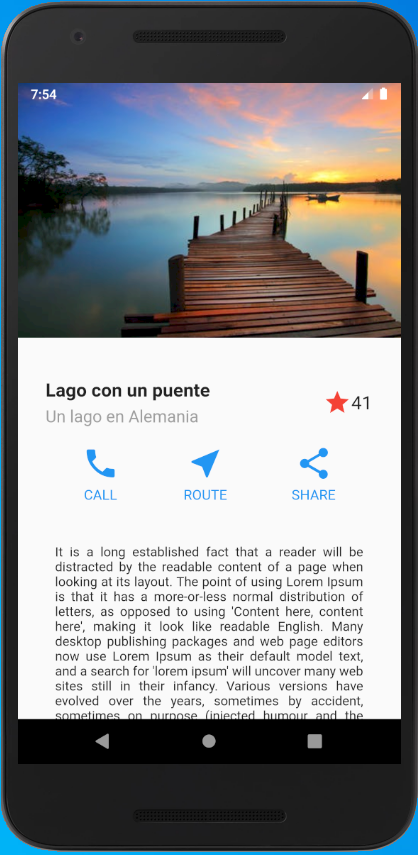
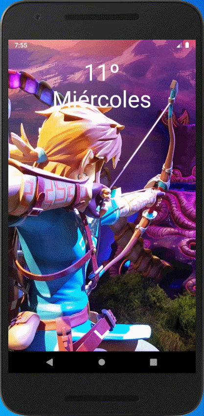
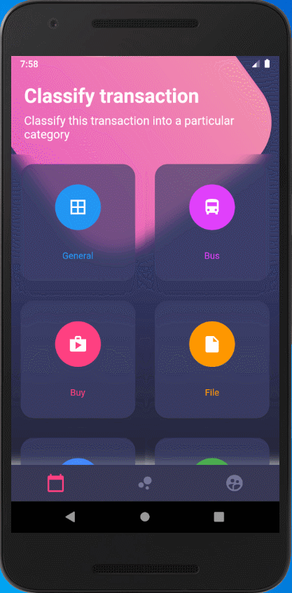

# Proyecto

<table border="0">
    <tr>
        <td></td>
        <td>Proyecto que contiene material visual que se puede realizar con el Framework Flutter</td>
    </tr>
</table>

## Observaciones

Sin uso de librerías externas

## Resultados

<table border="0">
    <tr>
        <td></td>
        <td></td>
        <td></td>
    </tr>
</table>